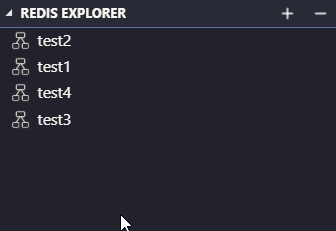
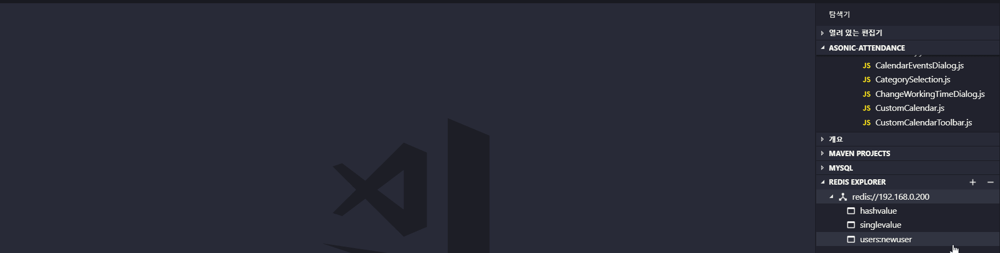
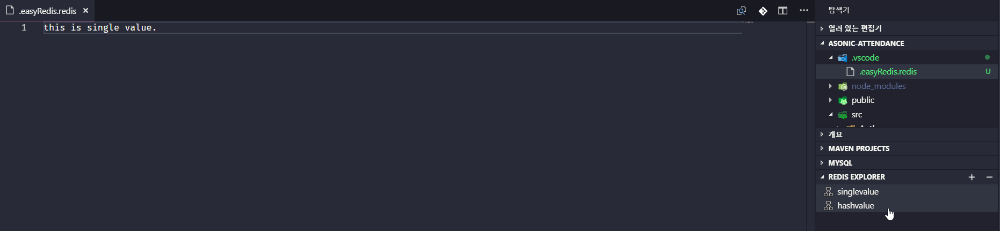
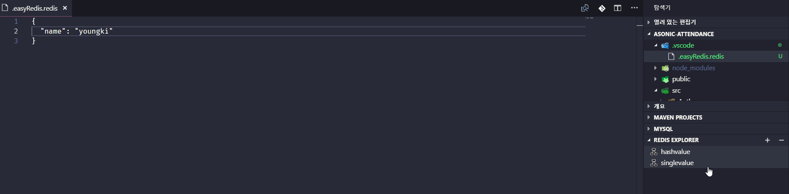
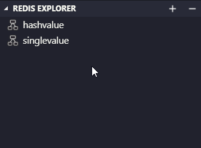
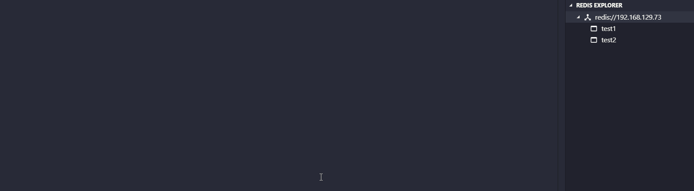

<!-- TOC -->

- [Note](#note)
- [Features](#features)
- [Usage](#usage)
- [Extension Settings](#extension-settings)
- [Contribution](#contribution)

<!-- /TOC -->

## Note

To easily access to Redis Server from UI.

Add `.vscode/.easyRedis.redis` file to `.gitignore`

## Features

1. List up keys on Redis explorer
2. Once you click one of keys, it will open a temporary editable file.
3. As you save the file, it will automatically store it to Redis.
4. Add and delete key from Redis explorer.

## Usage

- [`Add server`] Add redis server address. (`Ctrl+Shift+p` or directly edit `easyRedis.address` in settings.json)

```conf
# url format example
# Connect to 127.0.0.1:6380, db 4, using password "authpassword"
redis://:authpassword@127.0.0.1:6380/4
```


- Once adding redis server address correctly, you will be able to see the list of keys on `REDIS EXPLORER`.



- [`Server Info`] As you click on root, you can see the server info that you provided.



- [`Edit single value`] You can edit `value` that held by `key` on text editor and save it (`ctrl+s`) to store it to Redis.



- [`Edit hash value`] Hash type value MUST be written in `JSON` form.



- [`Delete item`] Click on a key you want to delete and then click `-` icon on each item.



- [`Flush DB`] You can now use "flush db" feature that delete all items at once.



- [`Add item`] Click on `+` icon, put key string, edit value and save it (`ctrl+s`)!


- [`Refresh`] Click on `refresh` icon that look like circle'ish in order to reconnect and refresh tree view. You can use this to reconnect redis as well after `disconnect` redis

- [`Disconnect`] Click on `disconnect` icon to disconnect redis.

## Extension Settings

- `easyRedis.address`: add redis server address in url form. (ex: redis://localhost)

## Contribution

If you have a great idea to make this better, please email me at `yellowgg2@gmail.com` or fork the [repo](https://github.com/yellowgg2/easy-redis) and submit pull requests.

**Enjoy!**
